# AWS-Based-Honeypot-with-Real-Time-Attack-Detection-and-SNS-Alerting
## 📌 Project Overview
This project demonstrates the implementation of an **AWS-based honeypot system** designed to attract, detect, and monitor malicious network activity in a cloud environment.  
A publicly exposed EC2 instance is intentionally configured as a decoy server to capture real-world attack traffic.  
The system uses **AWS-native monitoring and alerting services** to simulate a real SOC (Security Operations Center) workflow.

---

## 🎯 Objectives
- Deploy a cloud-based honeypot using AWS
- Attract and monitor real attacker traffic
- Capture attacker IPs and network behavior
- Centralize logs for analysis
- Generate real-time security alerts using SNS

---

## 🧱 Architecture Overview

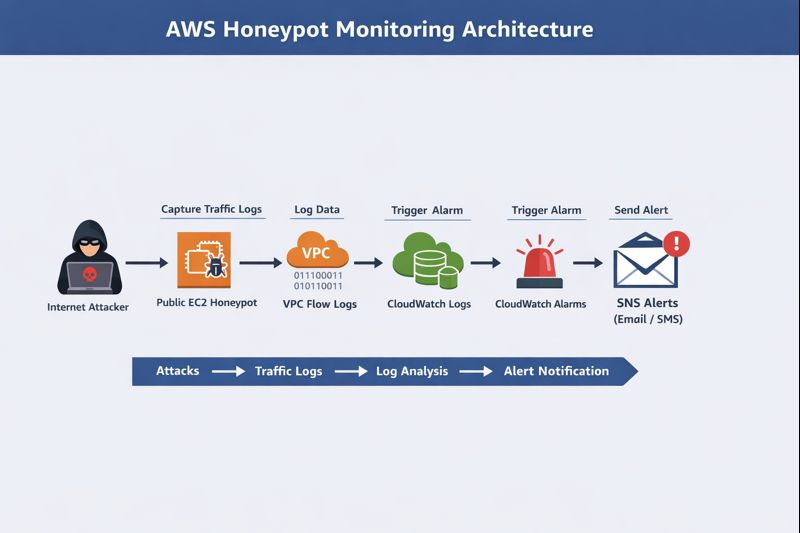

---

## 🛠️ Technologies Used
- **AWS EC2** – Honeypot server
- **AWS VPC** – Network isolation
- **Security Groups** – Open ports to attract attackers
- **VPC Flow Logs** – Capture network traffic
- **AWS CloudWatch** – Log storage and monitoring
- **AWS SNS** – Email alert notifications
- **AWS IAM** – Secure role-based access
- **AWS CloudTrail** – API activity logging

---

---

## Alerting Mechanism
- CloudWatch monitors **NetworkIn** metrics
- When traffic crosses a defined threshold:
  - Alarm state changes to **ALARM**
  - SNS sends an **email notification**
- This simulates real-time incident detection used in SOC environments

---

---

## 🛠️ Technologies Used
- **AWS EC2** – Honeypot server
- **AWS VPC** – Network isolation
- **Security Groups** – Open ports to attract attackers
- **VPC Flow Logs** – Network traffic capture
- **AWS CloudWatch** – Log storage and monitoring
- **AWS SNS** – Email alert notifications
- **AWS IAM** – Role-based access control
- **AWS CloudTrail** – API activity logging
- **Amazon S3** – Log storage

---

## ⚙️ Implementation Steps (High Level)
1. Created a public EC2 instance (Ubuntu) as a honeypot
2. Configured Security Groups with open SSH access
3. Created IAM role for VPC Flow Logs and CloudWatch
4. Enabled VPC Flow Logs
5. Stored logs in CloudWatch and S3
6. Created CloudWatch Alarm for abnormal traffic
7. Integrated SNS for email alerts
8. Tested alerts using simulated SSH attacks

---

## 🚨 Alerting Mechanism
- CloudWatch monitors **NetworkIn** metrics
- When traffic exceeds the threshold:
  - Alarm state changes to **ALARM**
  - SNS sends an **email notification**
- This simulates real-time incident detection used in SOC environments

---

## 📸 Screenshots

### 📷 Attacker Simulation
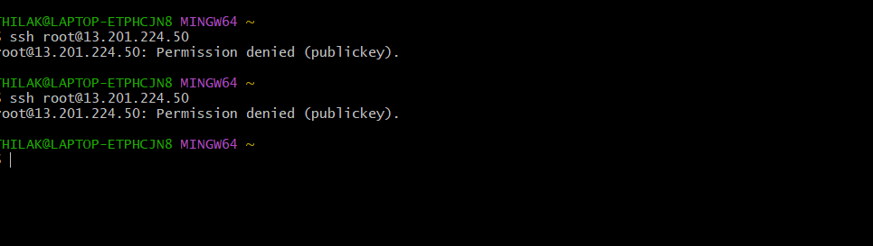

### 📷 VPC Configuration
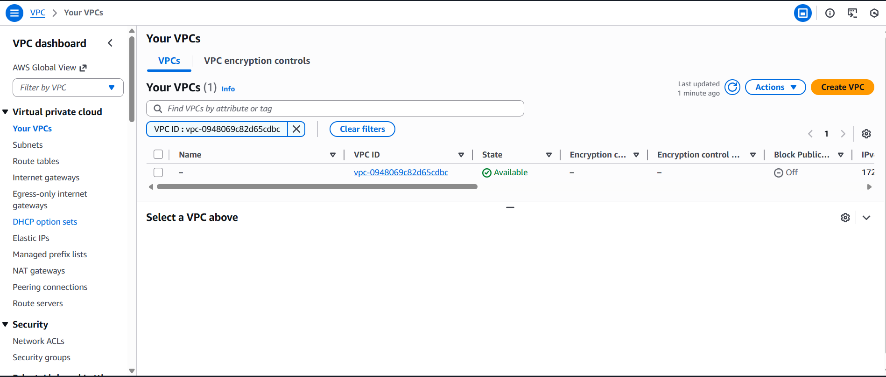

### 📷 Honeypot EC2 Instance
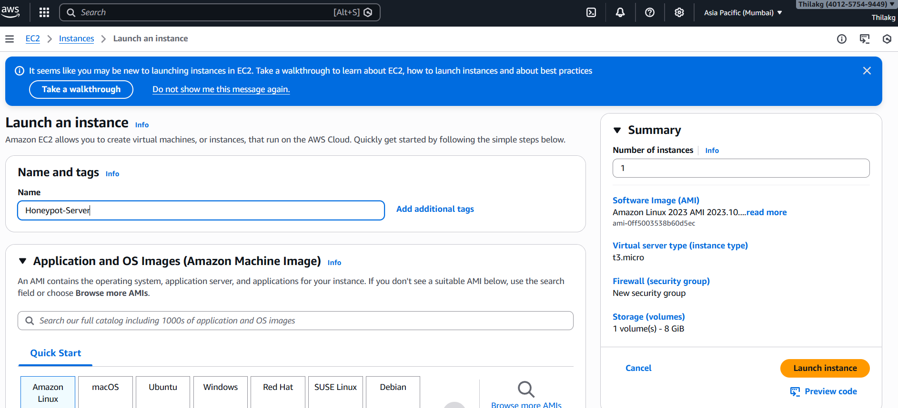

### 📷 Security Group Configuration
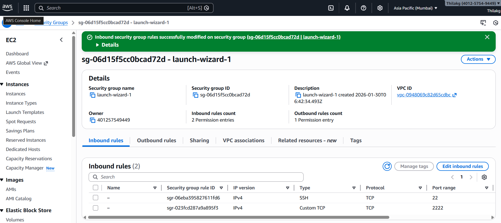

### 📷 IAM Role Creation
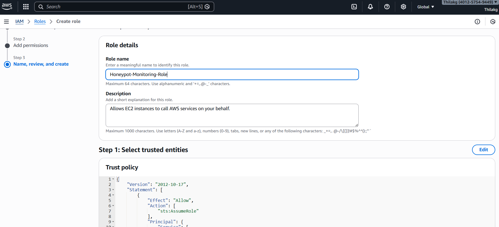

### 📷 IAM Role Attached
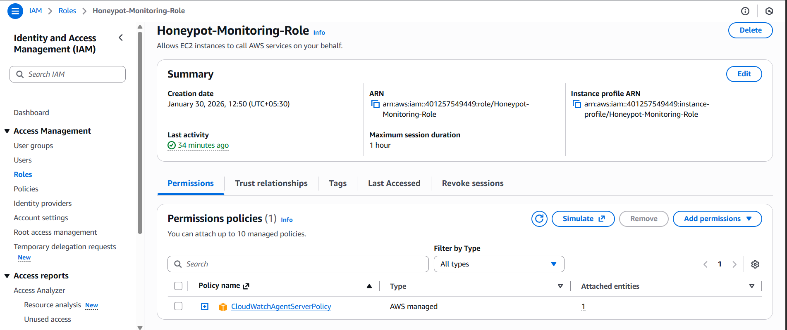

### 📷 VPC Flow Logs Creation
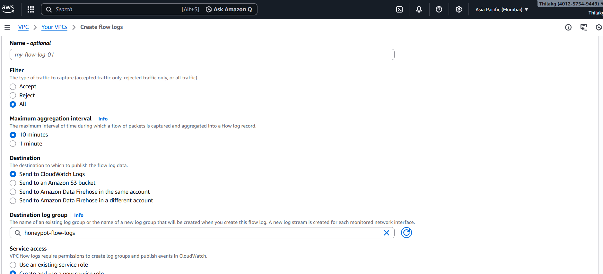

### 📷 VPC Flow Logs
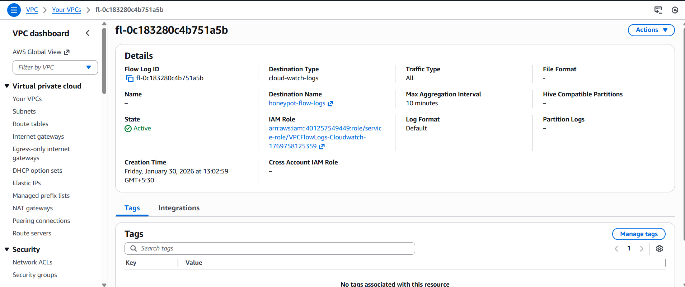

### 📷 VPC Flow Traffic

### 📷 CloudWatch Logs
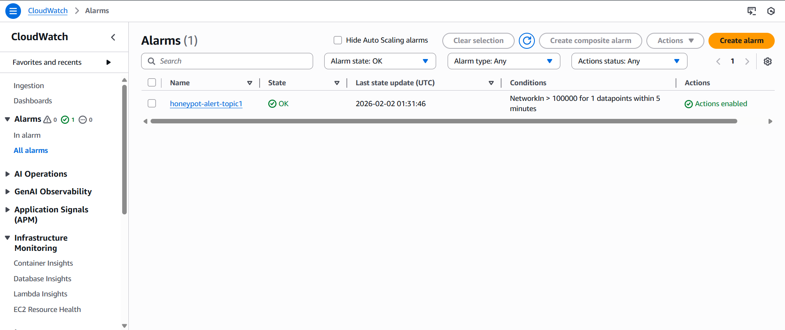

### 📷 CloudWatch Alarm
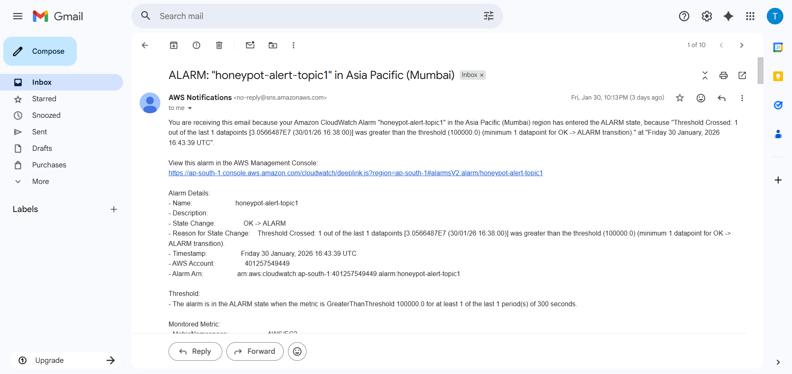

### 📷 SNS Email Alert

### 📷 CloudTrail Creation
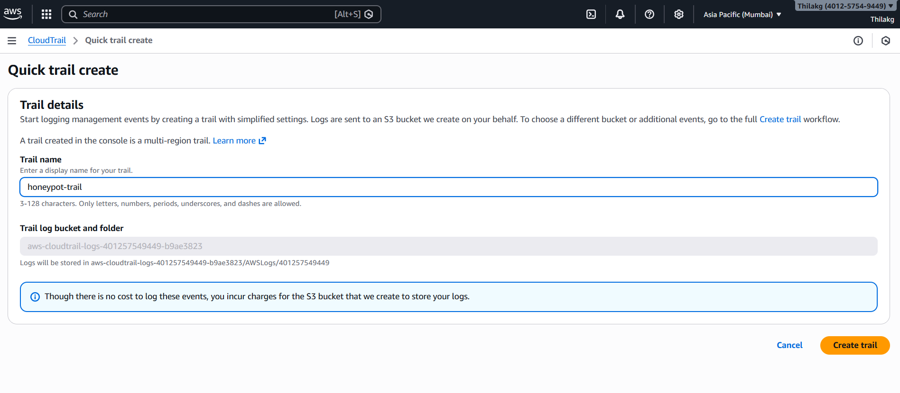

### 📷 CloudTrail Logs
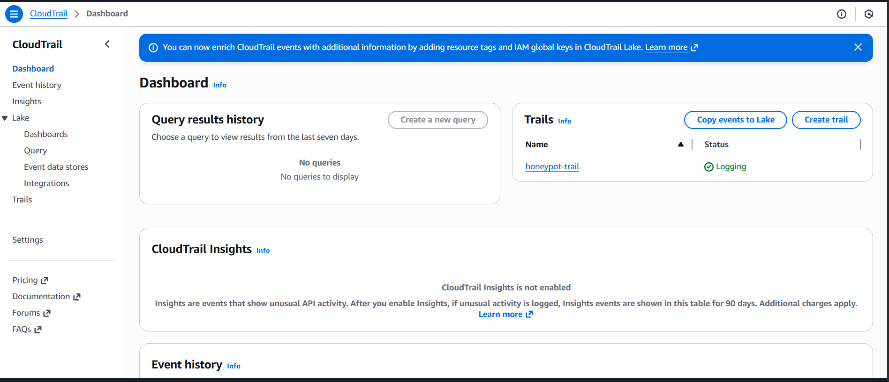

### 📷 Logs Stored in S3
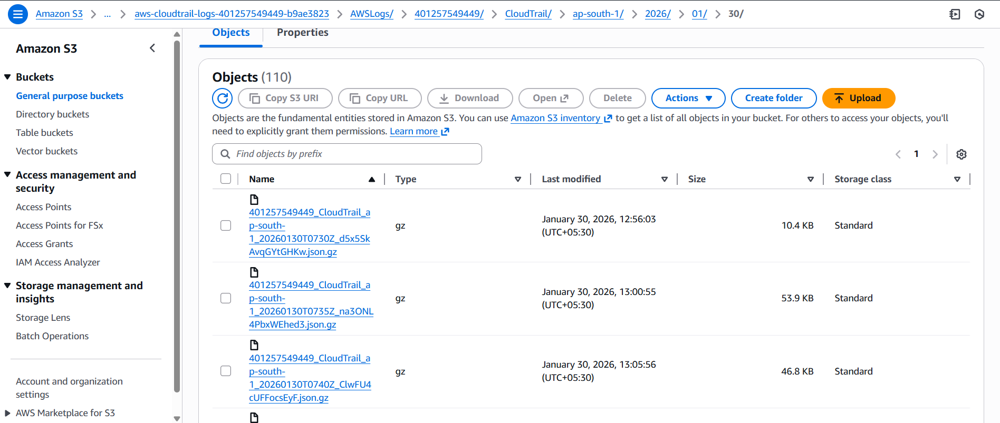

---

## 📊 Key Outcomes
- Successfully captured real attacker traffic
- Identified malicious source IP addresses
- Implemented centralized log monitoring
- Generated real-time security alerts
- Simulated SOC-level detection workflow

---

## 🎤 Interview Explanation (One Line)
> “I deployed an AWS-based honeypot using EC2 and detected real attacker traffic using VPC Flow Logs, CloudWatch, and SNS alerts.”

---

## 🚀 Future Enhancements
- Integrate SIEM tools (Elastic Stack / Splunk)
- Add GeoIP-based attacker visualization
- Automate IP blocking using AWS Lambda
- Map attacks to MITRE ATT&CK framework

---

## 👨‍💻 Author
**Thilak**  
Cybersecurity & Cloud Security Enthusiast

